# Sistema de Ventas Casino Universitario

Sistema de gestión de ventas para casinos universitarios desarrollado en Java con interfaz gráfica Swing. Permite realizar ventas, gestionar inventario, registrar clientes y administrar múltiples métodos de pago incluyendo tarjeta JUNAEB.

##  Características

- **Gestión de Ventas**: Proceso completo de venta con carrito de compras
- **Múltiples Métodos de Pago**: 
  - Efectivo (con cálculo de vuelto)
  - Tarjeta de crédito/débito
  - Tarjeta JUNAEB (con saldo virtual de $48.000)
- **Gestión de Inventario**: 
  - Visualización de productos disponibles
  - Actualización de stock
  - Registro de nuevos productos
- **Historial de Ventas**: Registro completo de todas las transacciones realizadas
- **Gestión de Clientes**: Registro automático de clientes con RUT y nombre
- **Persistencia de Datos**: Almacenamiento automático en archivo binario

##  Tecnologías Utilizadas

- **Lenguaje**: Java SE
- **Interfaz Gráfica**: Swing
- **Persistencia**: Serialización de objetos (archivo binario)
- **Arquitectura**: MVC (Modelo-Vista-Controlador)

## Digrama de Clases



##  Estructura del Proyecto

```
venta casino/
├── src/
│   ├── Main.java                      # Punto de entrada de la aplicación
│   ├── controlador/
│   │   └── ControladorCasino.java     # Lógica de negocio y persistencia
│   ├── modelo/
│   │   ├── Cliente.java               # Entidad Cliente
│   │   ├── DetalleVenta.java          # Detalle de productos en venta
│   │   ├── Producto.java              # Entidad Producto
│   │   └── Venta.java                 # Entidad Venta
│   └── vista/
│       ├── VistaPrincipal.java        # Ventana principal y menú
│       ├── PanelVenta.java            # Panel de proceso de venta
│       ├── PanelHistorial.java        # Panel de historial de ventas
│       └── PanelInventario.java       # Panel de gestión de inventario
└── datos_casino.bin                   # Archivo de persistencia (generado automáticamente)
```

##  Requisitos del Sistema

- Java Development Kit (JDK) 8 o superior
- Sistema operativo: Windows, Linux o macOS

##  Instalación y Ejecución

### Opción 1: Desde la terminal

1. Clonar o descargar el repositorio
2. Compilar el proyecto:
   ```powershell
   javac Main.java controlador/*.java modelo/*.java vista/*.java
   ```

4. Ejecutar la aplicación:
   ```powershell
   java Main
   ```

### Opción 2: Usando un IDE

1. Importar el proyecto en tu IDE favorito (IntelliJ IDEA, Eclipse, NetBeans)
2. Asegurarse de que el JDK esté configurado correctamente
3. Ejecutar la clase `Main.java`

##  Uso del Sistema

### Menú Principal

Al iniciar la aplicación, se presenta un menú con las siguientes opciones:

1. **Iniciar Venta**: Proceso completo de venta
2. **Listar Ventas**: Visualizar historial de transacciones
3. **Gestión Inventario**: Administrar productos y stock
4. **Salir**: Cerrar la aplicación

### Proceso de Venta

1. Seleccionar "Iniciar Venta" desde el menú principal
2. Buscar y agregar productos al carrito (especificar cantidad)
3. Ingresar datos del cliente (RUT y nombre)
4. Seleccionar método de pago:
   - **Efectivo**: Ingresar monto recibido (calcula vuelto automáticamente)
   - **Tarjeta**: Ingresar número de tarjeta y clave
   - **JUNAEB**: Ingresar código de 6 dígitos
5. Confirmar la venta

### Gestión de Inventario

- **Ver Productos**: Tabla con ID, nombre, precio y stock
- **Agregar Producto**: Formulario para registrar nuevos productos
- **Aumentar Stock**: Seleccionar producto y especificar cantidad a agregar

### Historial de Ventas

Visualiza todas las ventas realizadas con la siguiente información:
- ID de venta
- Fecha y hora
- Cliente (RUT y nombre)
- Método de pago
- Total
- Vuelto (si aplica)

## 🗃️ Modelo de Datos

### Cliente
- RUT (identificador único)
- Nombre
- Saldo JUNAEB (opcional)

### Producto
- ID
- Nombre
- Precio
- Stock disponible

### Venta
- ID (timestamp)
- Fecha y hora
- Cliente
- Lista de detalles (productos)
- Método de pago
- Total
- Vuelto

### DetalleVenta
- Producto
- Cantidad
- Subtotal

##  Persistencia de Datos

El sistema utiliza serialización de objetos Java para persistir los datos en el archivo `datos_casino.bin`. Los datos se guardan automáticamente después de cada operación que modifica el estado del sistema:

- Creación de nuevas ventas
- Modificación de inventario
- Registro de nuevos clientes

### Datos Iniciales

Al ejecutar por primera vez, el sistema carga los siguientes productos de ejemplo:

| ID  | Producto              | Precio | Stock |
|-----|-----------------------|--------|-------|
| 101 | Bebida Lata          | $1.200 | 50    |
| 102 | Sándwich Ave Palta   | $2.500 | 20    |
| 103 | Fajita Pollo         | $2.800 | 15    |
| 104 | Galleta Chocolate    | $500   | 100   |

##  Características de la Interfaz

- **Look and Feel**: Utiliza el tema nativo del sistema operativo
- **Diseño Responsive**: Componentes con tamaños adecuados y distribución optimizada
- **Navegación Intuitiva**: Sistema de pestañas (CardLayout) para cambiar entre vistas
- **Tablas Interactivas**: Para inventario e historial de ventas
- **Validaciones**: Mensajes de error claros para operaciones inválidas

##  Validaciones Implementadas

- Verificación de stock disponible antes de agregar al carrito
- Validación de monto en pago con efectivo
- Verificación de saldo JUNAEB suficiente
- Validación de formato de código JUNAEB (6 dígitos)
- Prevención de ventas con carrito vacío
- Control de duplicados en el carrito (actualiza cantidad si ya existe)

##  Manejo de Errores

El sistema maneja los siguientes tipos de errores:

- Stock insuficiente
- Datos de pago inválidos o incompletos
- Saldo JUNAEB insuficiente
- Carrito vacío al intentar finalizar venta
- Errores de persistencia (lectura/escritura de archivos)

